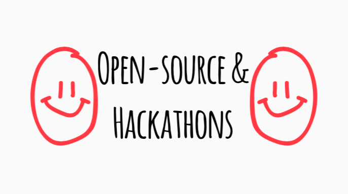

This is a collection of ***Open Source events and Hackathons***. Students always forget the dates of Open Source event and recall after the date is over to fill the form.

# <u> :footprints: January :seedling: </u>

- ## Open Source Event

    ### 1- Google Summer of Code [link](https://summerofcode.withgoogle.com)
     Organisation form start
    >  *****Google Summer of Code***** is a global program focused on introducing students to open source software development. Students work on a 3-month programming project with an open-source organization during their break from university.
    
    ### 2- JIIT Open-Source Developers Circle (JODC)
    Student Application form open
    > JIIT Month of Code is an online programme by the open-source club of Jaypee Institute of Information Technology, JIIT Noida-128, the JODC, focused on introducing students to open source software development and documentation writing.

    ### 3- GirlScript Summer of Code [link](https://www.gssoc.tech)
    Mentor Application Start
    > **GirlScript Summer of Code** is the 3 months long Open Source program during summers conducted by GirlScript Foundation, started in 2018, with an aim to help beginners get started with Open Source Development while encouraging diversity.
    
    ### 4- Outreachy [Link](https://www.outreachy.org)
    
    >***Outreachy*** provides internships to work in open source and free software.  Outreachy internships are open to applicants around the world. Interns work remotely and are not required to move. Interns are paid a stipend of $5,500 USD for the three-month internship. Interns have a $500 USD travel stipend to attend conferences or events.

# <u> :raising_hand_man: February :herb: </u>

- ## Open Source Event

    ### 1- STEP(Google) [link](https://careers.google.com/students/engineering-and-technical-internships/)
    > Our STEP program is a developmental opportunity for ***first- and second-year undergraduate students*** with a passion for technology—especially students from historically underrepresented groups in the field.
    
    ### 2- Google Summer of Code [link](https://summerofcode.withgoogle.com)
    
    List of accepted mentoring organizations published
    >  ****Google Summer of Code**** is a global program focused on introducing students to open source software development. Students work on a 3-month programming project with an open-source organization during their break from university.

# <u> :man_technologist: March :four_leaf_clover: </u>

- ## Open Source Event

###  1- RAILS GIRLS SUMMER OF CODE [link](https://railsgirlssummerofcode.org)
Student application stage
   > **RAILS GIRLS SUMMER OF CODE** is a global fellowship program for ***women and non-binary coders***. Students receive a three-month scholarship to work on existing Open Source projects and expand their skill set.

# <u> :walking: April :bulb:</u>
- ## Open Source Event

# <u> :massage_man: May :full_moon_with_face:</u>
- ## Open Source Event

# <u> :running: June :hourglass_flowing_sand: </u>
- ## Open Source Event

# <u> :horse_racing: July :computer: </u>
- ## Open Source Event

# <u> :beers: August :mag:</u>
- ## Open Source Event

# <u> :taxi: September :spades:</u>
- ## Open Source Event

### 1- CodeHeat Coding Contest of FOSSASIA  [link](https://codeheat.org)

> In the Heat of the Code is a coding contest for [FOSSASIA projects on GitHub](https://github.com/fossasia/).  
>The contest runs until February. Grand prize winners will be invited to present their work at the [FOSSASIA OpenTechSummit](https://2020.fossasia.org/) in Singapore in March and will get up to 600 SGD in travel funding to attend, plus a free speaker ticket.
> Other participants will have the chance to win Tshirts, Swag and vouchers to attend Open Tech events in the region and will get certificates of participation.

# <u> :motorcycle: October :dart: </u>
- ## Open Source Event
        
    ### 1- Hacktoberfest [link](https://hacktoberfest.digitalocean.com)
    > Hacktoberfest is a month-long celebration of open source software run by DigitalOcean and DEV. Hacktoberfest is open to everyone in our global community. To participate, four pull requests must be submitted to public GitHub repositories. You can sign up anytime between October 1 and October 31.
    
# <u> :red_car: November :trophy: </u>
- ## Open Source Event

    
# <u> :earth_americas: December :flight_departure: </u>
- ## Hacakthon
    ### 1- SIH (Smart India Hackathon) [link](https://www.sih.gov.in)  [Linkdin](https://www.linkedin.com/company/smart-india-hackathon-2020/) 
    >-   ***World’s Biggest Hackathon and Open Innovation model***, an initiative by Ministry of HRD 4th edition of highly successful.
    >-   Smart India Hackathon initiative Involves 2 Lakh+ students with 57,000+ ideas from 2200+ institutions against 530+ problem statements provided by 120+ organizations from across India.
    >-   Be part of World’s biggest Open Innovation Movement Opportunity to work with some of the best talents in the country

- ## Open Source Event

    ### 1- KWoC (Kharagpur Winter of Code)  [link]()
    >Kharagpur Winter of Code is a 5-week long online programme for students who are new to open source software development. The programme not only helps students to get involved in open source, but also prepares them for many open source summer programmes; Google Summer of Code being one of them. The program is hosted by ***Kharagpur Open Source Society*** an independent student group at IIT Kharagpur, but is open to students of any university.

    ### 2- KDE Student Programs.  [link](https://season.kde.org/)    
    > Focused on offering an opportunity to anyone (not just enrolled students) contributing to the KDE community, this is a program that is comparable to the well-known Google Summer of Code, with some special differences. A key difference is that [SoK](https://community.kde.org/SoK) projects are not limited to code-focused work, but any that benefit our community. For instance, projects can be about documentation, reports, translation, system administration, web and other types of work as well as code.

 
 
 
 
 

## Contribution Guidelines

-   Pick an open issue from the  [issue list](https://github.com/anubhavsingh16/Open-Source-Events/issues)  and claim it in the comments. After approval fix the issue and send us a pull request (PR).
-   Or you can create a new issue. A community member will get back to you and, if approved, you can fix the issue and send a pull request.
-   Please go through our issue list first (open as well as closed) and make sure the issue you are reporting does not replicate an issue already reported. If you have issues on multiple pages, report them separately. Do not combine them into a single issue.
-   All the PR’s need to be sent to the appropriate branch (usually "master").
